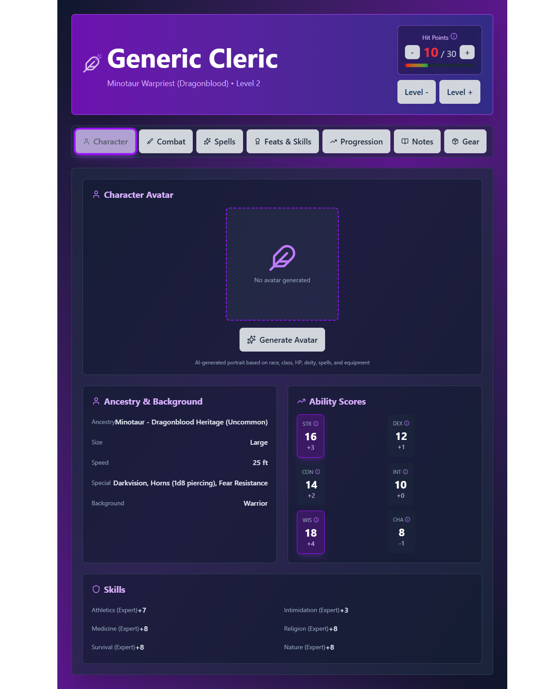
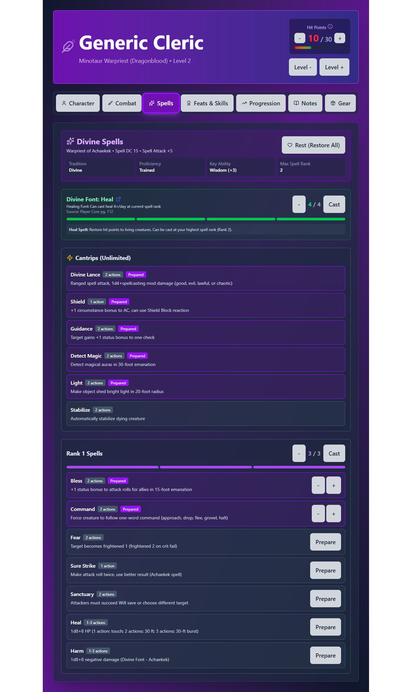

# Talon Tracker

A comprehensive **Pathfinder 2e Remaster character sheet web application** for tracking "Generic Cleric" - a Minotaur Warpriest Cleric with Dragonblood Heritage.


## 📸 Screenshots

<div align="center">

| Overview Tab | Combat Tab | Spells Tab |
|:---:|:---:|:---:|
|  |  |  |
| Character identity, abilities, skills | AC, attacks, saves, combat stats | PF2e spell preparation system |

</div>

> **Test Results**: See [docs/screenshots/test-results/](docs/screenshots/test-results/) for Playwright test screenshots

## ✨ Features

### 🎨 Modern Tab-Based Interface
- **Six Dedicated Tabs** - Overview, Combat, Spells, Feats/Skills, Progression, Gear
- **Shared Component Library** - Consistent UI/UX across all tabs
- **Responsive Design** - Purple/slate theme with Tailwind CSS
- **Accessibility** - ARIA labels, keyboard navigation, screen reader support

### 📊 Overview Tab
- **Character Identity** - Name, ancestry, heritage, background
- **Ability Scores** - All 6 abilities with modifiers, visual boost tracking
- **Skills** - All 17 PF2e skills with proficiency ranks
- **Pathbuilder Integration** - Import/export character data to/from Pathbuilder 2e JSON

### ⚔️ Combat Tab
- **Armor Class** - Complete AC calculation with equipment bonuses and tooltips
- **Attacks** - Unarmed strikes (Fist, Horns) with attack/damage breakdowns
- **Saving Throws** - Fortitude, Reflex, Will with proficiency progression
- **Spell DC & Attack** - Spellcasting statistics
- **Real-time Updates** - All stats update based on level and equipment

### ✨ Spells Tab (PF2e-Compliant)
- **Prepared Spellcasting** - Official PF2e prepared spell rules
- **Individual Instance Tracking** - Prepare same spell multiple times
- **Divine Font** - Heal/Harm choice with separate slot pool (4-6 slots)
- **Spell Browser** - Search and filter divine spells
- **Spell Cards** - Detailed spell information with heightening effects
- **Source Attribution** - All spells link to Archives of Nethys

### 🎯 Feats & Skills Tab
- **Three-Way View** - By Level, Skills, Feats
- **Skill Proficiencies** - All 17 skills with rank increases
- **Feat Browser** - Filter by type (ancestry, class, skill, general)
- **Prerequisite Validation** - Shows available feats based on character
- **Level Progression** - See all upgrades gained at each level

### 📈 Progression Tab
- **Level Timeline** - Visual progression from 1-20
- **Ability Boosts** - Track boosts at levels 5, 10, 15, 20
- **Proficiency Progression** - See when skills/weapons/saves increase
- **Class Features** - All Warpriest features by level
- **Milestone Markers** - Highlight important levels (5, 10, 15, 20)

### 🎒 Gear Tab
- **Equipment Slots** - Weapon, armor, shield management
- **Rune System** - Add/upgrade fundamental and property runes
- **Equipment Browser** - Filter by category and level
- **Stat Impact** - Real-time display of equipment bonuses
- **Bulk Tracking** - Visual carrying capacity (coming soon)

## 🚀 Live Demo

**[View Live Site](https://your-site-name.netlify.app)** (will be available after deployment)

## 🛠️ Tech Stack

- **React 19.1.1** - UI library with modern hooks
- **Vite 7.1.7** - Lightning-fast build tool and dev server
- **Tailwind CSS 4.1.16** - Utility-first CSS framework
- **Lucide React** - Beautiful icon library
- **Playwright** - End-to-end testing framework
- **Ollama API** - Local AI for storytelling (optional)

## 📦 Installation

### Prerequisites
- Node.js 18+
- npm or yarn

### Setup

1. **Clone the repository**
   ```bash
   git clone https://github.com/YOUR_USERNAME/talon-tracker.git
   cd talon-tracker
   ```

2. **Install dependencies**
   ```bash
   npm install
   ```

3. **Start development server**
   ```bash
   npm run dev
   ```

4. **Open in browser**
   ```
   http://localhost:5174
   ```

## 🧪 Testing

### Run all tests
```bash
# Unit tests
node src/characterFunctions.test.js

# UI tests (requires dev server running)
node test-ui.js
```

**Test Coverage**: 100/100 tests passing ✅
- HP calculations
- Ability score progression (with 18+ cap)
- Proficiency bonuses
- Spell slot progression
- Character configuration validation

## 🏗️ Build for Production

```bash
# Build optimized production bundle
npm run build

# Preview production build locally
npm run preview
```

Build output goes to `dist/` directory.

## 🌐 Deployment

### Netlify (Recommended)

**Automatic deployment from GitHub:**

1. Push code to GitHub
2. Import project in [Netlify](https://netlify.com)
3. Build settings are auto-configured from `netlify.toml`
4. Deploy! 🚀

**Manual deployment:**

```bash
npm run build
netlify deploy --prod --dir=dist
```

### Other Platforms

- **Vercel**: Auto-detects Vite, zero config needed
- **GitHub Pages**: Use `vite build --base=/talon-tracker/`
- **Static hosting**: Upload `dist/` folder anywhere

## 📁 Project Structure

```
talon-tracker/
├── src/
│   ├── App.jsx                  # Main application & state management
│   ├── pathfinderRules.js       # Official PF2e rules cache with URLs
│   ├── characterConfig.js       # Character data and progression
│   ├── pathbuilderUtils.js      # Pathbuilder import/export utilities
│   ├── sharedComponents.jsx     # Shared component library (15 components)
│   ├── components/shared/       # Additional shared components
│   │   ├── Tooltip.jsx          # Reusable tooltip with accessibility
│   │   ├── Modal.jsx            # Modal dialogs
│   │   ├── StatBlock.jsx        # Stat containers
│   │   ├── Badge.jsx            # Label badges
│   │   └── index.js             # Component exports
│   ├── NewOverviewTab.jsx       # Character identity & skills tab
│   ├── NewCombatTab.jsx         # Combat stats tab
│   ├── NewSpellsTab.jsx         # Spell management tab
│   ├── NewFeatsSkillsTab.jsx    # Feats & skills tab
│   ├── NewProgressionTab.jsx    # Level progression tab
│   ├── NewGearTab.jsx           # Equipment management tab
│   ├── main.jsx                 # React entry point
│   └── index.css                # Global Tailwind styles
├── docs/
│   ├── screenshots/
│   │   ├── ui/                  # UI screenshots
│   │   └── test-results/        # Playwright test screenshots
│   └── archive/                 # Archived documentation
├── test-ui.js                   # Main Playwright UI tests
├── test-*-tab.cjs               # Individual tab tests
├── CLAUDE.md                    # AI agent instructions (26KB)
├── TAB_DESIGN_REVIEW.md         # Comprehensive design review
├── CHARACTER_AUDIT.md           # Rules compliance audit
├── COMPLIANCE_FIXES.md          # Applied fixes log
├── SPELL_PREPARATION_REVIEW.md  # PF2e spell rules explanation
├── netlify.toml                 # Netlify configuration
└── package.json                 # Dependencies & scripts
```

## 🎮 Usage Guide

### Character Overview
- View all character stats, ancestry, and attributes
- Edit character name with inline editing
- Track current/max HP with +/- buttons

### Combat Tab
- See AC with full breakdown
- Roll attacks with bonuses
- Check saving throws

### Spells Tab
- Prepare spells (multiple times per day)
- Cast spells to consume slots
- Rest to restore all spell slots
- Divine Font separate from regular slots

### Feats & Skills Tab
- Click feat slots to open picker
- Search/filter available feats
- Increase skill proficiency ranks
- View feat sources and URLs

### Equipment Tab
- View carrying capacity and bulk
- See all equipment stat bonuses
- Equip/unequip items
- Hover items for detailed tooltips

### Story Log
- View AI-generated campaign narrative
- Clear log when starting new campaign
- Export log for session summaries

## 🔧 Configuration

### Ollama API (Optional)

To enable AI storytelling:

1. Install [Ollama](https://ollama.com)
2. Pull the model: `ollama pull llama3.2:3b`
3. Update API URL in `src/App.jsx` if needed:
   ```javascript
   const apiUrl = 'http://YOUR_OLLAMA_SERVER:11434/v1/chat/completions';
   ```

### Continue Extension (VS Code)

AI coding assistant configured for this project:

1. Install [Continue](https://continue.dev) extension
2. Restart VS Code
3. Configuration auto-loaded from `.continue/config.json`

See [.continue/QUICK_START.md](.continue/QUICK_START.md) for usage guide.

## 📖 Documentation

### Core Documentation
- **[CLAUDE.md](CLAUDE.md)** - Complete AI agent instructions and project overview (26KB)
- **[TAB_DESIGN_REVIEW.md](TAB_DESIGN_REVIEW.md)** - Comprehensive design review with roadmap
- **[CHARACTER_AUDIT.md](CHARACTER_AUDIT.md)** - Pre-fix rules compliance audit
- **[COMPLIANCE_FIXES.md](COMPLIANCE_FIXES.md)** - All applied fixes with before/after

### Rules & Systems
- **[SPELL_PREPARATION_REVIEW.md](SPELL_PREPARATION_REVIEW.md)** - Official PF2e spell rules explanation
- **[RULES_CACHE_SUMMARY.md](RULES_CACHE_SUMMARY.md)** - Documentation of pathfinderRules.js
- **[MINOTAUR_CLERIC_CHARACTER_SHEET.md](MINOTAUR_CLERIC_CHARACTER_SHEET.md)** - Character reference

### Technical
- **[FUNCTION_DOCUMENTATION.md](FUNCTION_DOCUMENTATION.md)** - All function documentation
- **[src/components/shared/README.md](src/components/shared/README.md)** - Shared components guide
- **[DEPLOYMENT_GUIDE.md](DEPLOYMENT_GUIDE.md)** - Deployment instructions

### Archived
- **[docs/archive/session-summaries/](docs/archive/session-summaries/)** - Historical session logs

## 🎯 Rules Compliance

All character calculations are **verified against official Pathfinder 2e Remaster sources**:

- ✅ Player Core (Classes, Ancestries, Equipment)
- ✅ Howl of the Wild (Minotaur, Dragonblood Heritage)
- ✅ [Archives of Nethys](https://2e.aonprd.com) (Official reference)

**100% test coverage** on all core calculation functions.

## 🐛 Known Issues

- AI storytelling requires external Ollama server
- Avatar generation requires OpenAI-compatible image API
- Some equipment needs manual entry (not in database)

## 🚀 Roadmap

See **[TAB_DESIGN_REVIEW.md](TAB_DESIGN_REVIEW.md)** for detailed implementation roadmap.

### High Priority
- [ ] Migrate all tabs to use shared components
- [ ] Implement prerequisite validation in FeatsSkillsTab
- [ ] Add shield raise toggle in CombatTab
- [ ] Add spell filtering and favorites in SpellsTab
- [ ] Add ability boost allocation UI in ProgressionTab

### Medium Priority
- [ ] Bulk tracking in GearTab
- [ ] Concentration tracker in SpellsTab
- [ ] Feat recommendation system
- [ ] Mobile responsiveness improvements
- [ ] Performance optimization (memoization, virtual scrolling)

### Low Priority
- [ ] Visual enhancements (icons, animations)
- [ ] Spell history tracking
- [ ] Printable character sheets
- [ ] Multiple character support
- [ ] Export character to PDF

## 📜 License

MIT License - See [LICENSE](LICENSE) file for details

## 🙏 Acknowledgments

- **Paizo Inc.** - Pathfinder 2e Remaster
- **Archives of Nethys** - Official rules reference
- **Ollama** - Local LLM hosting
- **React Team** - React library
- **Vite Team** - Build tooling

## 📧 Contact

For questions, suggestions, or bug reports, please [open an issue](https://github.com/YOUR_USERNAME/talon-tracker/issues).

---

**Built with ⚔️ for Pathfinder 2e enthusiasts**

*Powered by React, Vite, and AI storytelling*
